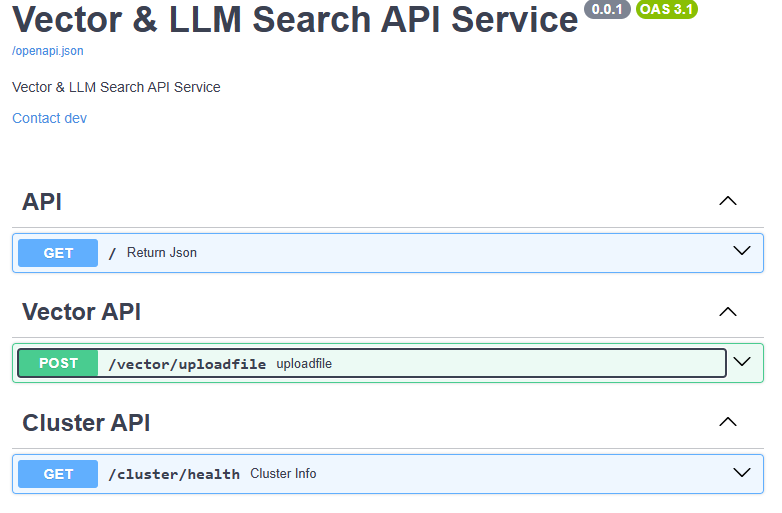

# Vector_DB_with_LLM
<i>Vector_DB_with_LLM


FastAPI is a modern, fast (high-performance), web framework for building APIs with Python 3.8+ based on standard Python.
This is a repository that provides to deliver the records to the Prometheus-Export application.

LangChain(https://github.com/langchain-ai/langchain) is a framework for developing applications powered by large language models (LLMs). LangChain is an open source framework for building applications based on large language models (LLMs). LLMs are large deep-learning models pre-trained on large amounts of data that can generate responses to user queries. for example, answering questions or creating images from text-based prompts. Prompts are queries people use to seek responses from an LLM.
- Example : https://colab.research.google.com/github/i-am-shuan/learn-langchain/blob/main/langchain_RAG_example.ipynb, https://velog.io/@kwon0koang/%EB%A1%9C%EC%BB%AC%EC%97%90%EC%84%9C-Llama3-%EB%8F%8C%EB%A6%AC%EA%B8%B0
- Documentation : https://wikidocs.net/231600
- Artical: https://hackernoon.com/lang/ko/ollama-python-%EB%B0%8Fchromdb%EB%A5%BC-%EC%82%AC%EC%9A%A9%ED%95%98%EC%97%AC-%EB%A1%9C%EC%BB%AC%EC%97%90%EC%84%9C-LLM%EC%9D%84-%EC%84%A4%EC%A0%95%ED%95%98%EB%8A%94-%EB%8B%A8%EA%B3%84%EB%B3%84-%EA%B0%80%EC%9D%B4%EB%93%9C%EB%A1%9C-%EB%82%98%EB%A7%8C%EC%9D%98-%EB%9E%98%EA%B7%B8-%EC%95%B1-%EB%A7%8C%EB%93%A4%EA%B8%B0
- Local LLM : https://github.com/firstpersoncode/local-rag?ref=hackernoon.com


VectorDB (i.e, Milvus, Faiss (Facebook AI Similarity Search), Chroma, Qdrant, Pinecone) : A Vector Database (VectorDB) is designed to store and manage vector data, often used in machine learning and AI applications. Vector data refers to numerical representations of objects, which can be used for similarity search, clustering, and other tasks. (Reference : https://krishna-yogik.medium.com/vectordb-tutorial-a-beginners-guide-06dc333fac2f)
- Use Cases of VectorDB
    - Recommendations System: Powering personalized recommendations by finding similar users or items based on their vector representations. (Examples: Movie, music, or product recommendations)
    - Image and Video Retrieval: Enabling content-based image and video retrieval by searching for similar visual features.
    - Natural Language Processing (NLP): Finding semantically similar texts, documents, or queries using vector embeddings from models like BERT or Word2Vec. (Examples: Document clustering, sentiment analysis, semantic search)
    - Anomaly Detection: Identifying unusual patterns or outliers in high-dimensional data. (Fraud detection, network intrusion detection)


RAG(Retrieval Augemented Generation) is an AI technique that allows companies to automatically embed their most current and relevant proprietary data directly into their LLM prompt.
- We’re not just talking about structured data like a spreadsheet or a relational database.
- We mean retrieving all available data, including unstructured data: emails, PDFs, chat logs, social media posts, and other types of information that could lead to a better AI output.
- In a nutshell, RAG helps companies retrieve and use their data from various internal sources for better generative AI results. 
- To achieve this improved accuracy, RAG works in conjunction with a specialized type of database — called a vector database — to store data in a numeric format that makes sense for AI, and retrieve it when prompted.
- RAG can’t do its job without the vector database doing its job.
- Step (https://blog.naver.com/htk1019/223442628204) : Document Loader ⮕ Text Splitter ⮕ Embedding ⮕ Vector Store (Saving vector) ⮕ Retriver

Streamlit is an open-source Python framework for data scientists and AI/ML engineers to deliver interactive data apps
- https://github.com/streamlit/llm-examples, https://pypi.org/project/streamlit-chat/
- Streamlit Install & Run
```bash
pip install streamlit 
pip install streamlit-chat

streamlit run [streamlit-filenam.py] [--server.port 30001]
streamlit run app.py
```
- App testing : https://github.com/streamlit/llm-examples/blob/main/.github/workflows/app-testing.yml
- requirements-dev.txt
```bash
black==23.3.0
mypy==1.4.1
pre-commit==3.3.3
watchdog
pytest
```
- Codespaces (https://github.com/features/codespaces, https://velog.io/@profile_exe/Github-Codespaces): GitHub Codespaces gets you up and coding faster with fully configured, secure cloud development environments native to GitHub.

- PyAutoGUI lets your Python scripts control the mouse and keyboard to automate interactions with other applications. The API is designed to be simple. PyAutoGUI works on Windows, macOS, and Linux, and runs on Python 2 and 3. To install with pip, run `pip install pyautogui`. See the Installation page for more details (https://pyautogui.readthedocs.io/en/latest/)


#### Python V3.9 Install
- Gunicorn/FastAPI : https://chaechae.life/blog/fastapi-deployment-gunicorn#google_vignette
- Python3.11 with Openssl (https://datamoney.tistory.com/378)
```bash
sudo yum install gcc openssl-devel bzip2-devel libffi-devel zlib-devel git 
wget https://www.python.org/ftp/python/3.9.0/Python-3.9.0.tgz 
tar –zxvf Python-3.9.0.tgz or tar -xvf Python-3.9.0.tgz 
cd Python-3.9.0 
./configure --libdir=/usr/lib64 
sudo make 
sudo make altinstall 

# python3 -m venv .venv --without-pip
sudo yum install python3-pip

sudo ln -s /usr/lib64/python3.9/lib-dynload/ /usr/local/lib/python3.9/lib-dynload

# -- From Python ^3.10 , It need to be installed openssl
# openssl
cd /usr/local/src
wget https://www.openssl.org/source/openssl-1.1.1t.tar.gz
tar xvf openssl-1.1.1t.tar.gz

cd openssl-1.1.1t/
./config --prefix=/usr/local/ssl --openssldir=/usr/local/ssl shared zlib
make
sudo make install

export LDFLAGS="-L/usr/local/ssl/lib"
export CPPFLAGS="-I/usr/local/ssl/include"

# openssl확인
/usr/local/ssl/bin/openssl version
export LD_LIBRARY_PATH=/usr/local/ssl/lib:$LD_LIBRARY_PATH
echo $LD_LIBRARY_PATH  


sudo yum install gcc openssl-devel bzip2-devel libffi-devel zlib-devel git 
wget https://www.python.org/ftp/python/3.11.0/Python-3.11.0.tgz 
tar –zxvf Python-3.11.0.tgz or tar -xvf Python-3.11.0.tgz 
cd Python-3.11.0 

# --with-openssl-rpath=auto 옵션을 추가하여 파이썬이 자동으로 올바른 OpenSSL 라이브러리 경로를 찾도록 함
# ./configure --libdir=/usr/lib64 --with-openssl=/usr/local/ssl --with-openssl-rpath=auto
./configure --libdir=/usr/lib64 --with-openssl=/usr/bin/ssl --with-openssl-rpath=auto
sudo make 
sudo make altinstall 

# -- Error occurs when installing packages via pip like below
(.venv) -bash-4.2$ pip install elasticsearch==7.13
WARNING: pip is configured with locations that require TLS/SSL, however the ssl module in Python is not available.
WARNING: Retrying (Retry(total=4, connect=None, read=None, redirect=None, status=None)) after connection broken by 'SSLError("Can't connect to HTTPS URL because the SSL module is not available.")': /simple/elasticsearch/
WARNING: Retrying (Retry(total=3, connect=None, read=None, redirect=None, status=None)) after connection broken by 'SSLError("Can't connect to HTTPS URL because the SSL module is not available.")': /simple/elasticsearch/
ERROR: Operation cancelled by user

#--


python -m venv .venv
source .venv/bin/activate

# -- Swagger
pip install poetry
poetry add fastapi
poetry add uvicorn
poetry add gunicorn
poetry add pytz
poetry add httpx
poetry add pytest
poetry add pytest-cov
poetry add requests
poetry add pyyaml
poetry add elasticsearch==7.13
poetry add python-dotenv


# --
# -- Vector
poetry config virtualenvs.in-project true
pip install poetry
poetry init
poetry add openai langchain langchainhub tiktoken chromadb langchain-community bs4 python-dotenv
poetry add sentence-transformers
poetry add pypdf
poetry add docx2txt
poetry add faiss-cpu
poetry add requests

pip install --q openai langchain langchainhub tiktoken chromadb langchain-community bs4

# when error occur like this
# ImportError: urllib3 v2 only supports OpenSSL 1.1.1+, currently the 'ssl' module is compiled with 'OpenSSL 1.0.2k-fips  26 Jan 2017'. See: https://github.com/urllib3/urllib3/issues/2168
pip install urllib3==1.26.18
pip install pytz
pip install requests==2.27.1
```


### API Run
- Start service using `./service-start.sh`
- FYI) Install library with setup.py like `pip install git+https://github.com/jm/git_pip_install.git` or `git+https://oss.navercorp.com/nsml/nsml_notebook.git@branch_name` (https://liferecorde.tistory.com/49, https://newsight.tistory.com/296)
- Extract text using langchain.document_loaders with tika (`./Langchain/workflow/`)
```bash
curl -X 'POST' \
  'http://localhost:7001/vector/uploadfile' \
  -H 'accept: application/json' \
  -H 'Content-Type: multipart/form-data' \
  -F 'file=@Sample.doc;type=application/msword'

{
  "filename": [
    {
      "index": {
        "_index": "test_context",
        "_type": "search"
      }
    },
    {
      "ES_UPLOADED": "JSON_FORMAT",
      "CONTENT": "This is a test Word document for the TemplatePackage example site."
    }
  ]
}
```
- Start and Extract text using langchain.community packages using `python ./Langchain/workflow/text_loader.py`
```bash
***
type : <class 'list'> / len : 1
data : [Document(metadata={'source': 'C:\\Users\\euiyoung.hwang\\Git_Workspace\\Vector_DB_with_LLM/Data/Sample.hwp'}, page_content='KTX 노선도ﺎĀ    Ā※ KTX 소요 시간과 운임은 철도청의 사정에 따라 변동할 수 있습니다.Ā서울용산광명Ā천안아산대전서대전동대구익산논산김제밀양정읍구포장성광주부산광주송정나주목포ĀྠĀ     경부선  ྠĀ     호남선ĀĀKTX 소요시간호남선 (서울~천안아산 경부선과 동일)서울서대전논산익산김제정읍장성광주광주송정나주목포시:분6:226:517:15-7:38--8:06-8:38경부선서울용산광명천안아산대전동대구밀양구포부산시:분5:305:456:246:307:187:498:148:27KTX 운임안내최저운임8,100원 (월~목 요금제 기준)호남선 (단위:원)행신8,1008,10015,10024,50026,40028,80031,20032,80035,00037,10039,00040,40044,80040,000용산8,10013,30022,70024,70027,20029,60031,20033,40036,30037,50038,90043,30038,400광명11,30020,70022,60025,10028,60029,40031,60034,50036,40037,10041,50036,700천안아산9,40011,40014,00017,70019,10021,70024,70026,60027,70032,20027,300서대전8,1008,1008,30010,00012,70015,90018,10019,70024,30019,300계룡8,1008,1008,10010,70014,00016,10017,70022,50017,400논산8,1008,1008,10011,40013,50015,10020,20014,800익산8,1008,1008,1009,80011,40016,50011,100김제8,1008,1008,1009,70014,8009,300정읍8,1008,1008,10012,1008,100장성8,1008,1008,9008,100광주송정8,1008,100-나주8,100-목포-광주경부선 (단위:원)행신8,1008,10014,10022,80039,70044,20047,80049,100서울8,10012,70021,40038,40043,00046,60047,900광명10,50019,20036,50041,00044,60046,000천안아산8,70025,60029,40032,90034,200대전16,90022,10025,30026,700동대구8,1009,30010,800밀양8,1008,100구포8,100부산')]
page_content : KTX 노선도ﺎĀ    Ā※ KTX 소요 시간과 운임은 철도청의 사정에 따라 변동할 수 있습니다.Ā서울용산광명Ā천안아산대전서대전동대구익산논산김제밀양정읍구포장성광주부산광주송정나주목포ĀྠĀ     경부선  ྠĀ     호남선ĀĀKTX 소요시간호남선 (서울~천안아산 경부선과 동일)서울서대전논산익산김제정읍장성광주광주송정나주목포시:분6:226:517:15-7:38--8:06-8:38경부선서울용산광명천안아산대전동대구밀양구포부산시:분5:305:456:246:307:187:498:148:27KTX 운임안내최저운임8,100원 (월~목 요금제 기준)호남선 (단위:원)행신8,1008,10015,10024,50026,40028,80031,20032,80035,00037,10039,00040,40044,80040,000용산8,10013,30022,70024,70027,20029,60031,20033,40036,30037,50038,90043,30038,400광명11,30020,70022,60025,10028,60029,40031,60034,50036,40037,10041,50036,700천안아산9,40011,40014,00017,70019,10021,70024,70026,60027,70032,20027,300서대전8,1008,1008,30010,00012,70015,90018,10019,70024,30019,300계룡8,1008,1008,10010,70014,00016,10017,70022,50017,400논산8,1008,1008,10011,40013,50015,10020,20014,800익산8,1008,1008,1009,80011,40016,50011,100김제8,1008,1008,1009,70014,8009,300정읍8,1008,1008,10012,1008,100장성8,1008,1008,9008,100광주송정8,1008,100-나주8,100-목포-광주경부선 (단위:원)행신8,1008,10014,10022,80039,70044,20047,80049,100서울8,10012,70021,40038,40043,00046,60047,900광명10,50019,20036,50041,00044,60046,000천안아산8,70025,60029,40032,90034,200대전16,90022,10025,30026,700동대구8,1009,30010,800밀양8,1008,100구포8,100부산
***

[
  {
    "index": {
      "_index": "test_context",
      "_type": "search"
    }
  },
  {
    "ES_UPLOADED": "JSON_FORMAT",
    "CONTENT": "KTX 노선도ﺎĀ    Ā※ KTX 소요 시간과 운임은 철도청의 사정에 따라 변동할 수 있습니다.Ā서울용산광명Ā천안아산대전서대전동대구익산논산김제밀양정읍구포장성광주부산광주송정나주목포ĀྠĀ     경부선  ྠĀ     호남선ĀĀKTX 소요시간호남선 (서울~천안아산 경부선과 동일)서울서대전논산익산김제정읍장성광주광주송정나주목포시:분6:226:517:15-7:38--8:06-8:38경부선서울용산광명천안아산대전동대구밀양구포부산시:분5:305:456:246:307:187:498:148:27KTX 운임안내최저운임8,100원 (월~목 요금제 기준)호남선 (단위:원)행신8,1008,10015,10024,50026,40028,80031,20032,80035,00037,10039,00040,40044,80040,000용산8,10013,30022,70024,70027,20029,60031,20033,40036,30037,50038,90043,30038,400광명11,30020,70022,60025,10028,60029,40031,60034,50036,40037,10041,50036,700천안아산9,40011,40014,00017,70019,10021,70024,70026,60027,70032,20027,300서대전8,1008,1008,30010,00012,70015,90018,10019,70024,30019,300계룡8,1008,1008,10010,70014,00016,10017,70022,50017,400논산8,1008,1008,10011,40013,50015,10020,20014,800익산8,1008,1008,1009,80011,40016,50011,100김제8,1008,1008,1009,70014,8009,300정읍8,1008,1008,10012,1008,100장성8,1008,1008,9008,100광주송정8,1008,100-나주8,100-목포-광주경부선 (단위:원)행신8,1008,10014,10022,80039,70044,20047,80049,100서울8,10012,70021,40038,40043,00046,60047,900광명10,50019,20036,50041,00044,60046,000천안아산8,70025,60029,40032,90034,200대전16,90022,10025,30026,700동대구8,1009,30010,800밀양8,1008,100구포8,100부산"
  }
]
```

- REST API URL: `http://localhost:7001/docs`



### Pytest
- Go to virtual enviroment using `source .venv/bin/activate`
- Run this command manually: `poetry run py.test -v --junitxml=test-reports/junit/pytest.xml --cov-report html --cov tests/` or `./pytest.sh`
```bash
$ ./pytest.sh
tests\test_api.py::test_skip SKIPPED (no way of currently testing this)                                                                                                                                                                                                                                           [ 50%]
tests\test_api.py::test_api PASSED                                                                                                                                                                                                                                                                                [100%]

---------- coverage: platform win32, python 3.11.7-final-0 -----------
Name                               Stmts   Miss  Cover   Missing
----------------------------------------------------------------
config\config.py                       8      4    50%   16-20, 33
config\log_config.py                  32      1    97%   42
controller\__init__.py                 0      0   100%
controller\cluster_controller.py      14      0   100%
injector.py                           25      0   100%
main.py                               23      9    61%   38-57, 69
service\__init__.py                    0      0   100%
service\es_search_handler.py         139    103    26%   32-88, 131-132, 139-155, 160-173, 178-191, 196-213, 219-254, 259-271, 276-287, 292-304, 309-315
service\es_util.py                    21     16    24%   5-11, 16-19, 24-35, 40-41
service\query_builder.py              42     27    36%   21-40, 48-51, 64-83, 89-98, 102-137
service\status_handler.py             13      2    85%   12, 19
tests\__init__.py                      0      0   100%
tests\conftest.py                      8      0   100%
tests\test_api.py                      9      1    89%   7
----------------------------------------------------------------
TOTAL                                334    163    51%

$
```


### CI/CD Environment
- CircleCI (`./circleci/config.yml`): CircleCI is a continuous integration and continuous delivery platform that helps software teams work smarter, faster. With CircleCI, every commit kicks off a new job in our platform, and code is built, tested, and deployed. 
- Github Actions (`./.github/workflows/build-and-test.yml`) : GitHub Actions is a continuous integration and continuous delivery (CI/CD) platform that allows you to automate your build, test, and deployment pipeline. You can create workflows that build and test every pull request to your repository, or deploy merged pull requests to production.


### Register Service
- sudo service vector_interface_api status/stop/start/restart
```bash
#-- /etc/systemd/system/vector_interface_api.service
[Unit]
Description=Swagger ES Service

[Service]
User=devuser
Group=devuser
Type=simple
ExecStart=/bin/bash /home/devuser/Git_Repo/service-start.sh
ExecStop= /usr/bin/killall vector_interface_api

[Install]
WantedBy=default.target


# Service command
sudo systemctl daemon-reload 
sudo systemctl start vector_interface_api.service 
sudo systemctl status vector_interface_api.service 
sudo systemctl stop vector_interface_api.service 

sudo service vector_interface_api status/stop/start
```
</i>
